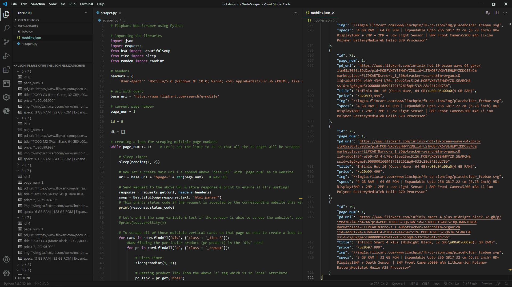

# Flipkart Web-Scraper using Python

A simple & efficient Web-Scraper implemented using Python libraries like _'requests'_ & _'BeautifulSoup4'_ that easily extracts the desired product details & dumps the scraped data automatically into a _'JSON'_ File.



## Installation

The Web-Scraper is coded in Python so ensure whether the following pre-requisites are met, in order to run it on your system.

### Pre-requisites:

[Python](https://www.python.org/downloads/)

```
Python 3.5.7 - Minimum version required to run the scraper is 'Python 3.5.7' or above.
```

[pip](https://pypi.org/project/pip/)

```
pip - Install 'pip' to download and install various Python Libraries directly from the Terminal.
```

'[requests' lib](https://pypi.org/project/requests/)

```
pip install requests - Install the 'requests' Python library using this 'pip' command.
```

'[BeautifulSoup4' lib](https://pypi.org/project/beautifulsoup4/)

```
pip install beautifulsoup4 - Install the 'beautifulsoup4' Python library using this 'pip' command.
```

## Description

- The Web-Scraper is build using Python libraries viz. _'requests'_ & _'bs4'_.
- The Scraper scrapes the product details viz. _title, price, image, url & specifications._
- Automatically converts & stores the scraped data in _JSON_ format with the _.json_ file extension.
- It has a _sleep timer_ implemented to reduce the load by sending limited no. of request at the given time to the remote server.

## Note

- This Web-Scraper project is just for educational/research purposes only!
- Scraping can be helpful in case extracting loads of data for Analysis/Research purpose!
- _'I am not responsible at any cost'_, if anyone uses it intentionally or unintentionally for any kind of other purposes which violates any Rules/Limitations of any corporation or organization!
- Before scraping any website just ensure that you're not voilating any of the Rules/Limitations or Terms & Conditions mentioned in the _/robots.txt_ of that particular website.

## Author

- [**Aditya Ambre**](https://github.com/AdityaAmbre)

## License

This project is licensed under the Apache-2.0 License - see the [LICENSE.md](LICENSE) file for details.

Copyrights © - 2020 Aditya Ambre. │ All Rights Reserved.
